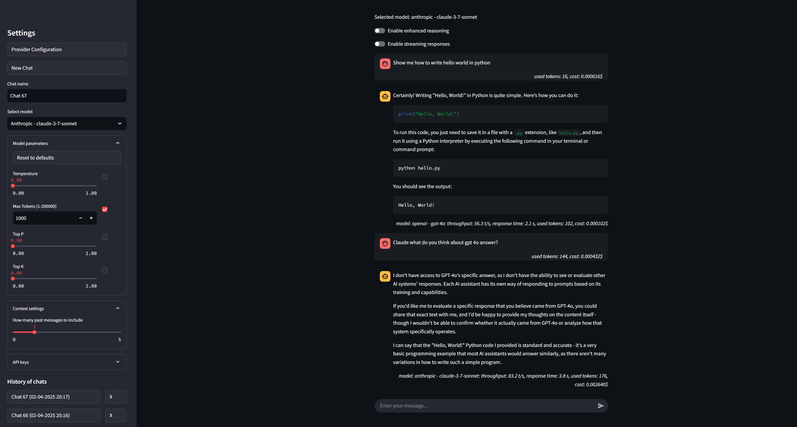

## View of Chat

## View of Config

## Creating a Virtual Environment

### Python 3.12
```sh
python -m venv env
source env/bin/activate  # Linux/macOS
env\Scripts\activate    # Windows
```

## Installing Dependencies
```sh
pip install -r requirements.txt
```

## Running the Application
```sh
streamlit run app.py
```

